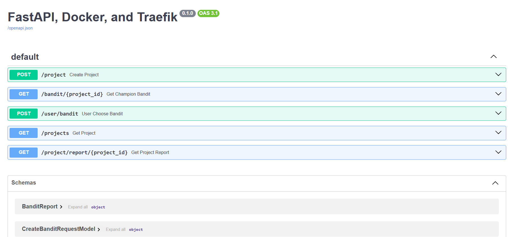

# Armenian Art Store Analysis
Group 3

Authors: <br>

Marina Kochinyan PM/PO <br>
Astghik Grigoryan DB Dev<br>
Lili Kostanyan Front-end dev<br>
Anna Hovakimyan Data-Analyst<br>
Hovik Voskanyan Back-End/Api Developer <br>

Created: 25/10/2024

## Installation

Before getting started, ensure you have the following prerequisites installed:

1. Clone the repository:
   ```bash
   git clone https://github.com/HovoVoskanyan/ArmenianArtStoreAnalysis.git
   ```

2. Change Directory:
   ```bash
   cd armenianartstore
   ```

3. Build and start the Docker containers:
   ```bash
   docker-compose up --build
   ```

## Access the Application

After running `docker-compose up --build`, you can access each component of the application at the following URLs:

- **Streamlit Frontend**: [http://localhost:8501](http://localhost:8501)  
  The main interface for managing employees, built with Streamlit. Use this to add, view, update, and delete employee records.

- **FastAPI Backend**: [http://localhost:8000](http://localhost:8000)  
  The backend API where requests are processed. You can use tools like [Swagger UI](http://localhost:8000/docs) (provided by FastAPI) to explore the API endpoints and their details.

- **PgAdmin** (optional): [http://localhost:5050](http://localhost:5050)  
  A graphical tool for PostgreSQL, which allows you to view and manage the database. Login using the credentials set in the `.env` file:
  
  - **Email**: Value of `PGADMIN_EMAIL` in your `.env` file
  - **Password**: Value of `PGADMIN_PASSWORD` in your `.env` file

> Note: Ensure Docker is running, and all environment variables in `.env` are correctly configured before accessing these URLs.

When running for the first time, you must create a server. 

  Hostname: db
  Maintenance database: ArmenianArtStore
  Username: postgres
  Password: group3

## Documentation
For documentation check : https://hovovoskanyan.github.io/ArmenianArtStoreAnalysis/

### Project Schema
```plaintext
.
├── .github
├── ArmenianArtstoreAnalysis
│   ├── back
│   │   ├── Database
│   │   │   ├── __init__.py
│   │   │   ├── database.py
│   │   │   ├── models.py
│   │   │   └── schema.py
│   │   ├── Models 
│   │   │   ├── Request
│   │   │   │   ├── __init__.py
│   │   │   │   └── request_classes.py
│   │   │   ├── Response
│   │   │   │   ├── __init__.py
│   │   │   │   └── response_classes.py
│   │   ├── .env
│   │   ├── Dockerfile
│   │   ├── main.py
│   │   └── requirements.txt
│   ├── etl
│   │   ├── __init__.py
│   │   ├── .env
│   │   ├── crud_testing.py
│   │   ├── crud.py
│   │   ├── database.py
│   │   ├── Dockerfile
│   │   ├── ERD.png
│   │   ├── models.py
│   │   └── requirements.txt
│   ├── ds
│   │   ├── __init__.py
│   │   ├── .env
│   │   ├── database.py
│   │   ├── Dockerfile
│   │   ├── models.py
│   │   ├── analysis.py
│   │   └── requirements.txt
│   ├── front
│   │   ├── .streamlit
│   │   │   └── config.toml
│   │   ├── assets
│   │   ├── pages
│   │   ├── styles
│   │   ├── app.py
│   │   ├── Dockerfile
│   │   └── requirements.txt
│   ├── db_admin 
│   ├── init.py
│   ├── .env
│   ├── docker-compose.yml
│   ├── documentation
│   │   ├── mkdocs.yml
│   │   └── README.md
└── requirements.txt
```

## Docker 

This repository sets up a Docker environment with three main services:

1. **PostgreSQL:** for data storage
2. **pgAdmin:** for database management and visualization
3. **ETL:** service for Extract, Transform, Load operations using Python


### ETL

In `models.py`, we have used `sqlalchemy` package, which allows map python objects with SQL objects.

By running `models.py` following objects will be created:
    - sql tables 
    - the corresponding connections

```yaml
FROM python:3.10-slim-bullseye

RUN apt-get update && apt-get install -y \
    build-essential libpq-dev libfreetype6-dev libpng-dev libjpeg-dev \
    libblas-dev liblapack-dev gfortran \
    && rm -rf /var/lib/apt/lists/*

# Set working directory
WORKDIR /etl

# Copy requirements file and install dependencies
COPY requirements.txt .
RUN pip3 install --upgrade pip
RUN pip3 install -r requirements.txt

# Copy the rest of the application code
COPY . .

# Expose port 3000
EXPOSE 3000

# Command to run the python file
CMD ["python", "models.py"]

```

## API  

We created a service for the **API** part of the project, which handles core functionalities such as managing projects, user feedback, and retrieving reports.

### **Features**  

- **Add New Project**:  
  Enter the project name, and under the bandits, enter the main page name and the quantity of bandits to create the project.  

- **User Feedback**:  
  Submit the bandit name and the reward as a Boolean (`true/false`).  

- **Get Champion Bandit**:  
  Retrieve the **champion bandit** of the predefined project to display to the user.  

- **Get Projects**:  
  List all already created projects.  

- **Get Project Report**:  
  Retrieve the bandits of a specific project along with their parameters (e.g., **alpha** and **beta** values).  




### **Requests**  

- **POST** `/project`: Create a new project.  
- **GET** `/bandit/{project_id}`: Get the **champion bandit**.  
- **POST** `/user/bandit`: Submit user feedback for the current bandit.  
- **GET** `/projects`: Get all existing projects.  
- **GET** `/project/report/{project_id}`: Retrieve all bandits of a specific project, including **alpha** and **beta** values.  

---

## **Services**  

We use Docker services for efficient deployment and management of components.  

### **Database**  

```yaml
  db:
    container_name: postgresql_db
    image: postgres
    restart: always
    ports:
      - 5432:5432
    environment:
      - POSTGRES_USER=${DB_USER}
      - POSTGRES_PASSWORD=${DB_PASSWORD}
      - POSTGRES_DB=${DB_NAME}
    healthcheck:
        test: ["CMD-SHELL", "pg_isready -U postgres"]
        interval: 60s
        timeout: 10s
        retries: 5
    volumes:
      - ./postgres_data:/var/lib/postgresql/data
```
## DS

We created a service for the **data-science** part of the project, which is responsible for writing and testing the **Thompson Sampling** code, which is then transferred to the Back-End branch to work with FastAPI.

```Dockerfile

# Pull the official Python image
FROM python:3.10-slim-bullseye

# Install system dependencies required for some Python packages
RUN apt-get update && apt-get install -y \
    build-essential libpq-dev libfreetype6-dev libpng-dev libjpeg-dev \
    libblas-dev liblapack-dev gfortran \
    && rm -rf /var/lib/apt/lists/*

# Set the working directory inside the container
WORKDIR /ds

# Copy the requirements file and install dependencies
COPY requirements.txt .
RUN pip3 install --upgrade pip
RUN pip3 install -r requirements.txt

# Copy the DS code into the container
COPY . .

# Expose a relevant port for DS tools (if necessary)
EXPOSE 8888  # Optional: If using Jupyter or other tools

# Command to run the Thompson Sampling script
CMD ["python", "Thompson_sampling.py"]
```

### Service

```yaml
ds:
    container_name: ds
    build:
      context: ./ds  # Directory where the Dockerfile for the DS is located
      dockerfile: Dockerfile
    volumes:
      - ./ds:/ds  # Sync the local DS directory with the container
    ports:
      - "8888:8888"  # Useful if using Jupyter or other DS tools
    environment:
      - DATABASE_URL=${DATABASE_URL}  # Environment variable for database URL
    depends_on:
      - db  # Ensure DS container waits for the database container

```

## Web Application

We created a service for the **front-end** part of the project, which is responsible for hosting the **Streamlit web application**.

To open the main web app, visit: [here](http://localhost:8501/)

Additionally, we have an analytical page of our results, which you can access at: [here](http://localhost:8501/admin)

### Dockerfile

```Dockerfile
# Dockerfile

# Pull the official Docker image
FROM python:3.10-slim-bullseye

# Install system dependencies required by some Python packages
RUN apt-get update && apt-get install -y \
    build-essential libpq-dev libfreetype6-dev libpng-dev libjpeg-dev \
    libblas-dev liblapack-dev gfortran \
    && rm -rf /var/lib/apt/lists/*

# Set the working directory inside the container
WORKDIR /app

# Copy the requirements file and install Python dependencies
COPY requirements.txt .
RUN pip install --no-cache-dir -r requirements.txt

# Copy all the contents of the frontend directory into the container
COPY . .

# Expose Streamlit's default port
EXPOSE 8501

# Command to run the Streamlit application
CMD ["streamlit", "run", "app.py", "--server.port=8501", "--server.headless=true", "--server.runOnSave=true"]
```

### Service

```yaml
  app:
    container_name: streamlit_app
    build:
      context: ./front  # Directory where the Dockerfile for the frontend is located
      dockerfile: Dockerfile
    volumes:
      - ./front:/app  # Sync the local frontend directory with the container
    ports:
      - "8501:8501"  
    environment:
      - STREAMLIT_APP=app.py  
    depends_on:
      - api 
```